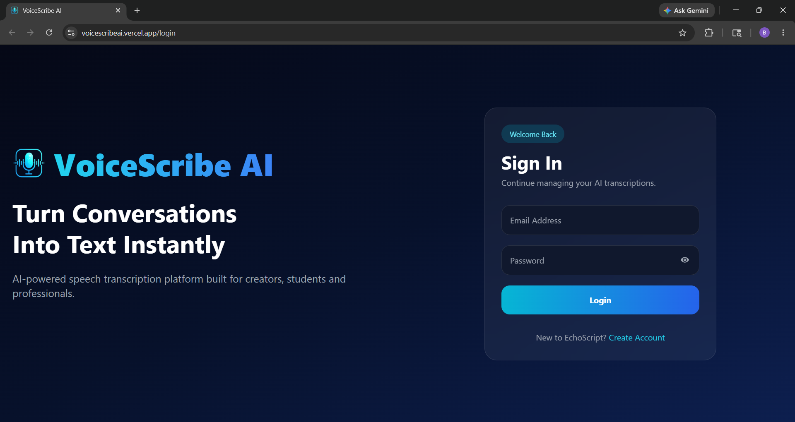
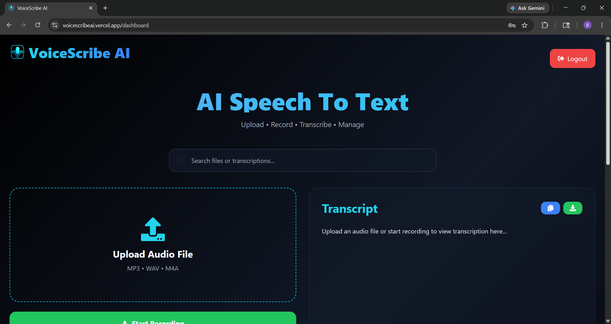
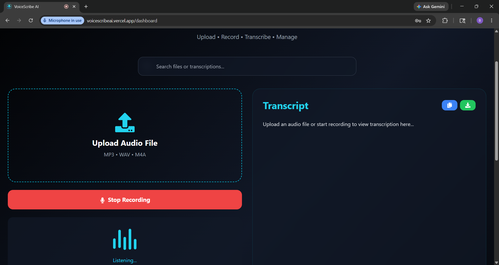
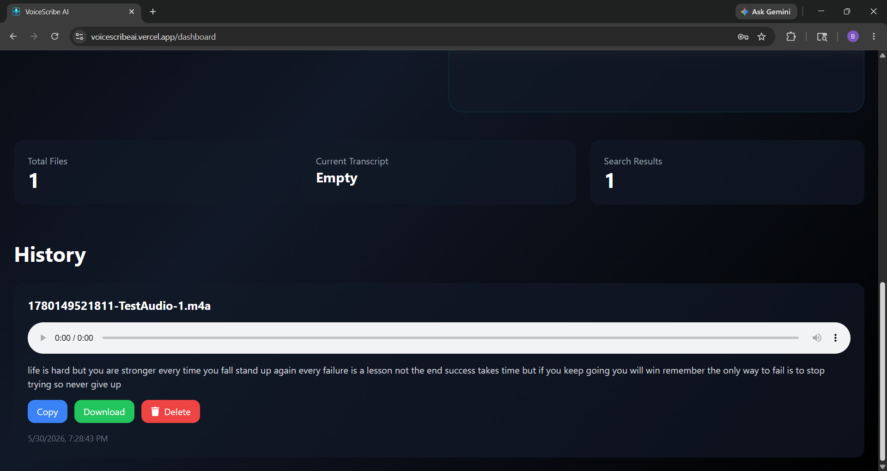

# VoiceScribe AI – Speech-to-Text Transcription Platform

## 🚀 Project Overview

VoiceScribe AI is a full-stack MERN application that converts audio into text using Deepgram Speech-to-Text technology. Users can upload audio files, record live speech, save transcriptions, manage transcription history, and search through previously saved transcripts.

The application provides a modern and responsive interface built with React and Tailwind CSS while securely storing user data and transcriptions using MongoDB.

---

## ✨ Features

### 🔐 Authentication

* User Registration
* User Login
* JWT Authentication
* Protected Routes
* User-specific Transcription History

### 🎙️ Speech-to-Text

* Upload Audio Files
* Live Voice Recording
* Real-Time Speech Recognition
* Deepgram Speech-to-Text Integration
* Save Live Transcripts

### 📂 Transcript Management

* Store Transcriptions in MongoDB
* View Transcription History
* Search Saved Transcripts
* Copy Transcript
* Download Transcript as TXT
* Delete Transcripts

### 🎨 Modern UI

* Responsive Design
* Tailwind CSS Styling
* Recording Animation
* Glassmorphism UI Elements
* Mobile Friendly Interface

---

## 🛠️ Tech Stack

### Frontend

* React.js
* Vite
* Tailwind CSS
* Axios
* React Router DOM
* React Icons
* React Hot Toast

### Backend

* Node.js
* Express.js
* Multer
* JWT Authentication
* bcrypt.js

### Database

* MongoDB
* Mongoose

### Speech Recognition

* Deepgram API
* Browser Web Speech API

---

## 📁 Project Structure

```text
speech-to-text-app
│
├── frontend
│   ├── src
│   │   ├── pages
│   │   ├── components
│   │   ├── services
│   │   └── App.jsx
│   │
│   └── package.json
│
├── backend
│   ├── config
│   ├── middleware
│   ├── models
│   ├── routes
│   ├── uploads
│   └── server.js
│
└── README.md
```

---

## ⚙️ Installation

### Clone Repository

```bash
git clone https://github.com/Pranav-Reddy29/speech-to-text-app.git
```

---

## Backend Setup

Navigate to backend folder:

```bash
cd backend
```

Install dependencies:

```bash
npm install
```

Create a `.env` file:

```env
PORT=5000

MONGO_URI=your_mongodb_connection_string

JWT_SECRET=your_jwt_secret

DEEPGRAM_API_KEY=your_deepgram_api_key
```

Start backend:

```bash
npm run dev
```

Backend runs on:

```text
http://localhost:5000
```

---

## Frontend Setup

Navigate to frontend folder:

```bash
cd frontend
```

Install dependencies:

```bash
npm install
```

Create a `.env` file:

```env
VITE_API_URL=http://localhost:5000
```

Start frontend:

```bash
npm run dev
```

Frontend runs on:

```text
http://localhost:5173
```

---

## Database Schema

### User Schema

```javascript
{
  name: String,
  email: String,
  password: String
}
```

### Transcription Schema

```javascript
{
  user: ObjectId,
  filename: String,
  audioPath: String,
  transcription: String,
  createdAt: Date
}
```

---

## API Endpoints

### Authentication

#### Register User

```http
POST /api/auth/register
```

#### Login User

```http
POST /api/auth/login
```

---

### Upload Audio

```http
POST /api/upload
```

---

### Generate Transcription

```http
POST /api/transcribe
```

---

### Save Live Transcript

```http
POST /api/transcribe/save-live
```

---

### Fetch History

```http
GET /api/transcribe
```

---

### Delete Transcript

```http
DELETE /api/transcribe/:id
```

---

## Workflow

1. User uploads an audio file or starts live recording.
2. Audio is sent to Deepgram Speech-to-Text API.
3. Generated transcript is displayed on the frontend.
4. Transcript is saved in MongoDB.
5. User can search, copy, download, or delete transcripts.

---

## Screenshots

### Login Page



### Dashboard



### Live Recording



### History Section



---

## Future Enhancements

* PDF Export
* AI Transcript Summarization
* AI Chat with Transcript
* Dark Mode
* User Profile Page
* Transcript Categorization
* Multi-language Support

---

## Learning Outcomes

Through this project, the following concepts were implemented:

* MERN Stack Development
* REST API Development
* Authentication & Authorization
* MongoDB Database Integration
* File Upload Handling
* Speech-to-Text Processing
* React State Management
* Responsive UI Design
* Third-Party API Integration

---

## Author

## Baddam Pranav kumar Reddy

VoiceScribe AI – Speech-to-Text Platform

---

## License

This project is developed for educational and internship learning purposes.
